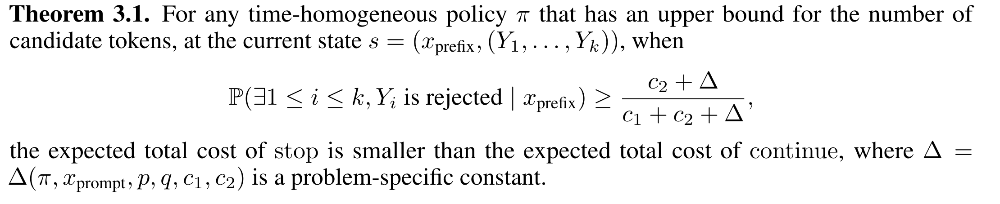

<h1 align='center' style="text-align:center; font-weight:bold; font-size:2.0em;letter-spacing:2.0px;"> SpecDec++: Boosting Speculative Decoding via Adaptive Candidate Lengths </h1>
<p align='center' style="text-align:center;font-size:1.25em;"> 
    <a href="https://hackyhuang.github.io/" target="_blank" style="text-decoration: none;">Kaixuan Huang</a>,&nbsp; <a href="https://www.linkedin.com/in/xudong-guo-835543aa/" target="_blank" style="text-decoration: none;"> Xudong Guo</a>,&nbsp;
    <a href="https://mwang.princeton.edu/" target="_blank" style="text-decoration: none;">Mengdi Wang</a>
    <br/>  
Princeton University
</p>

<p align='center';>
<b>
<em>ICML 2024 workshop on Efficient Systems for Foundation Models (ES-FoMo) </em> <br>
</b>
</p>

<p align='center' style="text-align:center;font-size:2.5 em;">
<b>
    <a href="https://arxiv.org/pdf/2405.19715" target="_blank" style="text-decoration: none;">arXiv</a>&nbsp;
</b>
</p>

----- 
We propose SpecDec++, an enhanced version of speculative decoding that adaptively determines the candidate length with the help of a trained acceptance prediction head. Our method can boost the performance of speculative decoding and can be combined with other tricks like fused kernel, quantization, and advanced KV cache management.


*Tested with llama-2-chat 7B & 70B model pair (bfloat16) on 2 NVIDIA A100-80G GPUs.

----

## Quick Links

- [Quick Links](#quick-links)
- [Overview of Speculative Decoding](#overview-of-speculative-decoding)
  - [Case I: There exists rejected tokens.](#case-i-there-exists-rejected-tokens)
  - [Case II: All tokens are accepted.](#case-ii-all-tokens-are-accepted)
- [Problem: Determination of the candidate length $K$.](#problem-determination-of-the-candidate-length-k)
  - [Our approach](#our-approach)
  - [Performance](#performance)
- [Using `SpecDec++`](#using-specdec)
  - [Checkpoint Release \& Sampling Code](#checkpoint-release--sampling-code)
- [Training and Evaluation](#training-and-evaluation)
  - [Dataset Preparation](#dataset-preparation)
  - [Training the Acceptance Prediction Heads.](#training-the-acceptance-prediction-heads)
  - [Benchmarking Performances.](#benchmarking-performances)
    - [To benchmark the performance of SpecDec ++, modify and run the following command.](#to-benchmark-the-performance-of-specdec--modify-and-run-the-following-command)
    - [To benchmark the performance of SpecDec, modify and run the following command.](#to-benchmark-the-performance-of-specdec-modify-and-run-the-following-command)
    - [To benchmark the performance without speculative decoding, modify and run the following command.](#to-benchmark-the-performance-without-speculative-decoding-modify-and-run-the-following-command)
    - [Sample results](#sample-results)
  - [Bugs or Questions](#bugs-or-questions)
  - [Citation](#citation)


----

## Overview of Speculative Decoding

In speculative decoding, the draft model first generates $K$ tokens. The target model computes their log probabilities *in parallel* and then sequentially determines whether each token is accepted or not. 

### Case I: There exists rejected tokens.

Following the first rejected token, the algorithm discards the remaining tokens and corrects the rejected token with a fresh sample from a modified distribution. 

<p align="center">
  
</p>

### Case II: All tokens are accepted.

If all tokens are accepted, a new token is sampled from the next-token probability given by the target model and appended to the sequence of accepted tokens, and then the process moves forward. 

<p align="center">
  
</p>

## Problem: Determination of the candidate length $K$.

`SpecDec++` aims to find a *theoretically justifiable* approach towards the following problem: what is a proper candidate length that generates as many accepted tokens and wastes as few discarded tokens as possible?


### Our approach


We formalize the dynamic choice of candidate length in speculative decoding as a Markov Decision
Process (MDP). We theoretically show that when the probability that at least one token gets rejected
exceeds a threshold, the optimal action is to stop the speculation and submit it for verification:




We augment the draft model with a trained acceptance prediction head to predict the conditional acceptance probability of the candidate tokens. `SpecDec++` will stop the current speculation round when the predicted probability that at least one token gets rejected exceeds a threshold.


### Performance

`SpecDec++` has better Pareto frontiers than `SpecDec` on both the in-distribution dataset Alpaca and the two out-of-distribution datasets HumanEval and GSM8K. Please check our paper for more details.


-----

## Using `SpecDec++`

**Step 0 (Optional)**: To start with, prepare a conda environment with pytorch installed. If not, you can use the following command.

```
conda create -n specdecpp python=3.11    
conda activate specdecpp 
conda install pytorch torchvision torchaudio pytorch-cuda=11.8 -c pytorch -c nvidia
```

**Step 1**: Clone the repository and install the required packages. 

```
git clone git@github.com:Kaffaljidhmah2/SpecDec_pp.git
cd SpecDec_pp
pip install -r requirements.txt
```


### Checkpoint Release & Sampling Code

The checkpoint of our best acceptance prediction head for llama-2-chat 7B & 70B model pair is available at [huggingface hub](https://huggingface.co/hacky/acchead-llama2-chat-7bx70b). 

Please take a look at [specdec_pp/sample.py](specdec_pp/sample.py) for how to use SpecDec++.

----


## Training and Evaluation

### Dataset Preparation

Follow the instructions in [data/readme.md](./data/readme.md) for dataset preparation. After running the code, you should be able to get the Alpaca dataset (`data/alpaca_data/train.json`, `data/alpaca_data/dev.json`, `data/alpaca_data/test.json`), HumanEval dataset (`data/humaneval_data/test.json`), and GSM8K test dataset (`data/gsm8k_test_data/test.json`) for llama-2-chat models.

### Training the Acceptance Prediction Heads.


Please modify the following code for training. Here `layer` indicates the number of layers of the ResNet prediction head, `weight` is the loss weight for the mismatched tokens for the BCE loss (the weight for the matched tokens is `1`). The mixing ratio can be set via `--mixing_ratio` (default is 0.15).

```bash
layer=3
weight=6
draft_model=meta-llama/Llama-2-7b-chat-hf

WANDB_PROJECT=specdecpp python3 specdec_pp/train.py \
    --data_path data/alpaca_data/train.json \
    --eval_data_path data/alpaca_data/dev.json \
    --output_dir exp-weight${weight}-layer${layer} \
    --model_name_or_path ${draft_model} \
    --bf16 True \
    --per_device_train_batch_size 4 \
    --num_train_epochs 3 \
    --gradient_accumulation_steps 8 \
    --logging_steps 5 \
    --evaluation_strategy epoch \
    --per_device_eval_batch_size 4 \
    --weight_mismatch ${weight} \
    --save_strategy no \
    --warmup_ratio 0.03 \
    --lr_scheduler_type cosine \
    --resnet_num_layers ${layer} \
    --mixing_ratio 0.15
```

### Benchmarking Performances.

#### To benchmark the performance of SpecDec ++, modify and run the following command. 

Note: `--num_assistant_tokens_schedule ada` indicates the proposed SpecDec++ method, where the ckeckpoint of the acceptance prediction head should be specified via `--assist_acc_head_dir`. `--stop_threshold` indicates the threshold value (between 0 and 1) used to stop the current speculation round. A larger `stop_threshold` indicates longer speculation rounds. `--bound MIN MAX` indicates the minimum number and the maximum number of candidate tokens for one speculation round.

```bash
layer=3  
weight=6 
thres=0.3 

ckpt=exp-weight${weight}-layer${layer}

target_model=meta-llama/Llama-2-70b-chat-hf
draft_model=meta-llama/Llama-2-7b-chat-hf
data=data/alpaca_data/test.json
SAVEPATH=test-results-alpaca/weight${weight}-layer${layer}-thres${thres}-bound2_20/

python3 specdec_pp/evaluate.py \
  --model_name ${target_model} \
  --assistant_name ${draft_model} \
  --num_assistant_tokens_schedule ada \
  --data_path ${data} \
  --assist_acc_head_dir $ckpt\
  --do_sample \
  --random_seed 42 \
  --save_path ${SAVEPATH} \
  --stop_threshold ${thres} \
  --bound 2 20
```

The result will be stored under the folder `${SAVEPATH}`.


####  To benchmark the performance of SpecDec, modify and run the following command. 

Note: `--num_assistant_tokens_schedule constant` indicates the baseline SpecDec method. `--num_assistant_tokens` means the constant number of candidate tokens generated per speculation round.

```bash
target_model=meta-llama/Llama-2-70b-chat-hf
draft_model=meta-llama/Llama-2-7b-chat-hf
K=4
data=data/alpaca_data/test.json
SAVEPATH=test-results-alpaca/baseline-${K}/

python3 specdec_pp/evaluate.py \
  --model_name ${target_model} \
  --assistant_name ${draft_model} \
  --num_assistant_tokens_schedule constant \
  --num_assistant_tokens ${K} \
  --data_path ${data} \
  --do_sample \
  --random_seed 42 \
  --save_path ${SAVEPATH} \
```

####  To benchmark the performance without speculative decoding, modify and run the following command. 

Note: `--num_assistant_tokens_schedule none` indicates the baseline SpecDec method.

```bash
target_model=meta-llama/Llama-2-70b-chat-hf
draft_model=meta-llama/Llama-2-7b-chat-hf
data=data/alpaca_data/test.json
SAVEPATH=test-results-alpaca/standalone/

python3 specdec_pp/evaluate.py \
  --model_name ${target_model} \
  --assistant_name ${draft_model} \
  --num_assistant_tokens_schedule none \
  --data_path ${data} \
  --do_sample \
  --random_seed 42 \
  --save_path ${SAVEPATH} \
```


#### Sample results

```
[
  {
    ## key-value pairs for prompt, continuation, prefix,  tokens, draft, p_acc, and id

    ## for SpecDec & SpecDec++
    "spec_time": 15.580421447753906,
    "num_mismatched_tokens": 20,
    "num_LM_call": 67,
    "generated_length": 180,
    ## for standalone target model / draft model
    "target_time": 25.6504251956939,
    "draft_time": 2.795105218887329,
    "generated_length_target": 203,
    "generated_length_draft": 134
  }
]
```

------


### Bugs or Questions

Feel free to send an email to `kaixuanh@princeton.edu` or create a GitHub Issue/Pull request.


### Citation

If you find this useful in your research, please consider citing our paper.

```bibtex
@article{huang2024specdec++,
  title={SpecDec++: Boosting Speculative Decoding via Adaptive Candidate Lengths},
  author={Huang, Kaixuan and Guo, Xudong and Wang, Mengdi},
  journal={arXiv preprint arXiv:2405.19715},
  year={2024}
}
```
